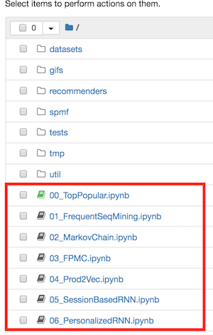
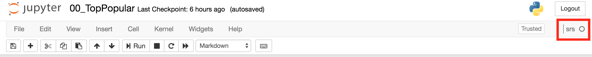
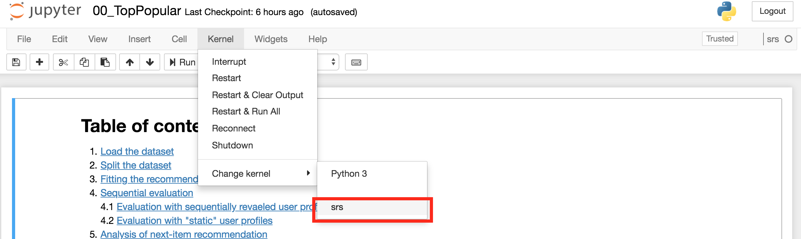

# RecSys 18 Tutorial on Sequence-Aware Recommenders

This is the repository for the hands-on session of the Tutorial on Sequence-Aware Recommenders at ACM RecSys 2018 in Vancouver.

## Additional material about the tutorial

All the additional material about the tutorial is hosted at [this page](https://sites.google.com/view/seq-recsys-tutorial/home).

## Running the code

You have two options to run the code contained in this repository:
1. Setup a new environment on your local machine and run the code locally (_highly recommended_).
2. Launch a new Binder instance by clicking on this badge [](https://mybinder.org/v2/gh/mquad/sars_tutorial/master). 

While we all know that setting up a new local environment is a slightly tedious process, Binder instances have strict resource limits (1-2GB of memory, max 100 concurrent users per repository). 
Also beware that Binder sessions automatically expire after 10 minutes of inactivity!  
So we *highly recommend* to set up a new local environment in advance by following the [Setup instructions](#setup-instructions).

### Setup instructions

1. First of all, clone this project to your local machine:
    ```bash
    git clone https://github.com/mquad/sars_tutorial.git
    ```

2. Now you need to set up a new python3 environment. We will use Anaconda/Miniconda for doing so.
If you don't have Anaconda/Minicoda already installed on your machine, click here to download [Miniconda](https://conda.io/miniconda.html) or [Anaconda](https://www.anaconda.com/download/) (**Python 3 version**).

3. After that, install the environment for this hands-on by running:
    ```bash
    cd sars_tutorial/
    conda env create --file environment.yml
    ```

4. (_Miniconda users only_) If you choose to install Miniconda before, you will now have to install Jupyter Notebook on your machine, just by running `conda install jupyter`. 
You can do it in your main python environment (necessarily in the `srs` env),  as long as you setup the kernel as explained after.
Anaconda users should already have Jupyter Notebook installed, so they can skip this step.

5. Then activate the environment with `source activate srs` or `conda activate srs`, and install a new `iptyhon` kernel by running:
    ```bash
    python -m ipykernel install --name srs
    ``` 
    If you get "Permission denied" error with the above command, try with
    ```bash
    python -m ipykernel install --name srs --user
    ``` 

6. Finally, launch the Jupyter Notebook with
    ```bash
    jupyter notebook --port=8888
    ```
and open it your browser at the address `localhost:8888`. 
(Beware, if port `8888` is already taken by another service, Jupyter Notebook will automatically open on a different one. Check out the startup log!).


### Running the notebooks

The notebooks used in this hands-on are listed in the main directory of this project, as shown below:



Click on the name of the notebook to open it in a new window. The name of each running notebook is highlighted in green 
(in the screen above, the notebook `00_TopPopular` is the only one running).

Before starting to execute the notebook cells, you have to ensure that the kernel is properly set to `srs`, like in the screen below:



If it's not your case, change the kernel to `srs` by clicking on `Kernel > Change kernel > srs` in the menu bar, as shown below:



NOTE: this requires the installation of the `srs` kernel, as explained in the [Setup instructions](#setup-instructions).

You can now start running the cells in the notebook! Yay!


# Acknowledgments

We want to sincerely thank [Umberto Di Fabrizio](https://www.linkedin.com/in/umbertodifabrizio) for developing large sections of this repository back when he was a MSc student at Politecnico di Milano. Great job Umberto!